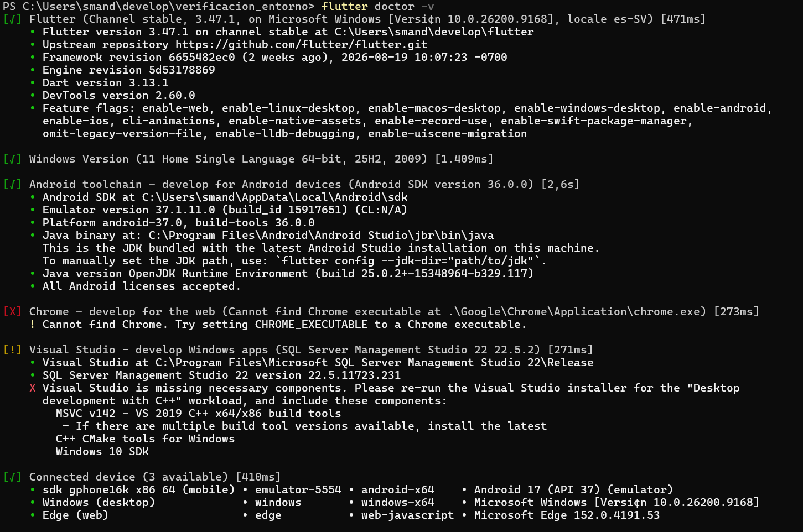

# Guía de preparación del entorno Flutter

## Introducción

Este proyecto corresponde a la evidencia de la Semana 2 del curso de Desarrollo de Aplicaciones Móviles de ESEN.

El objetivo fue preparar y verificar un entorno de desarrollo utilizando Flutter, Android Studio y un dispositivo para ejecutar una aplicación de prueba.

## 1. Versión de Flutter

Se verificó la versión estable de Flutter instalada mediante el comando `flutter --version`.

Este comando permitió comprobar que Flutter se encontraba instalado correctamente y mostrar la versión utilizada durante la preparación del entorno.

### Evidencia

## 2. Verificación del entorno

Se ejecutó el comando `flutter doctor -v` para verificar el estado de los componentes necesarios para el desarrollo. El resultado mostró correctamente Flutter y el Android toolchain.

### Evidencia

## 3. Dispositivo disponible

Se utilizó el comando `flutter devices` para comprobar que existía al menos un dispositivo disponible para ejecutar aplicaciones Flutter.

### Evidencia

## 4. Ejecución de la aplicación

Se ejecutó la aplicación de prueba de Flutter en el dispositivo configurado.

### Evidencia

## 5. Recarga en caliente

Para comprobar el funcionamiento de Hot Reload, se modificó el texto mostrado por la aplicación y se realizó una recarga en caliente.

### Antes del cambio

### Después del cambio

El cambio de texto se reflejó en la aplicación sin necesidad de detener y volver a ejecutar completamente el proyecto.

# Bitácora técnica

## Problema con las licencias de Android

Durante la configuración del entorno de desarrollo se presentó un problema al intentar aceptar las licencias del Android SDK después de instalar Android Studio.

Al ejecutar `flutter doctor`, se mostraba constantemente un error relacionado con las licencias de Android. También se intentó ejecutar `flutter doctor --android-licenses`, pero las licencias no podían aceptarse correctamente.

### Investigación

Se realizó una búsqueda en Internet para identificar la causa del problema. Durante la investigación se encontró un post de Reddit en el que otros usuarios reportaban un problema relacionado con la versión 23 de Android SDK Command-line Tools.

La información encontrada indicaba que el problema estaba relacionado con esta versión de las herramientas de línea de comandos.

### Solución

Para solucionar el problema, se ingresó al SDK Manager de Android Studio y se reemplazó la versión 23 de Android SDK Command-line Tools por la versión 22.

Posteriormente se volvió a ejecutar `flutter doctor --android-licenses` y fue posible aceptar las licencias correctamente.

Finalmente, se ejecutó nuevamente `flutter doctor -v` para verificar que el Android toolchain estuviera correctamente configurado.

### Resultado

El problema quedó solucionado y el entorno de desarrollo quedó preparado para ejecutar aplicaciones Flutter en Android.